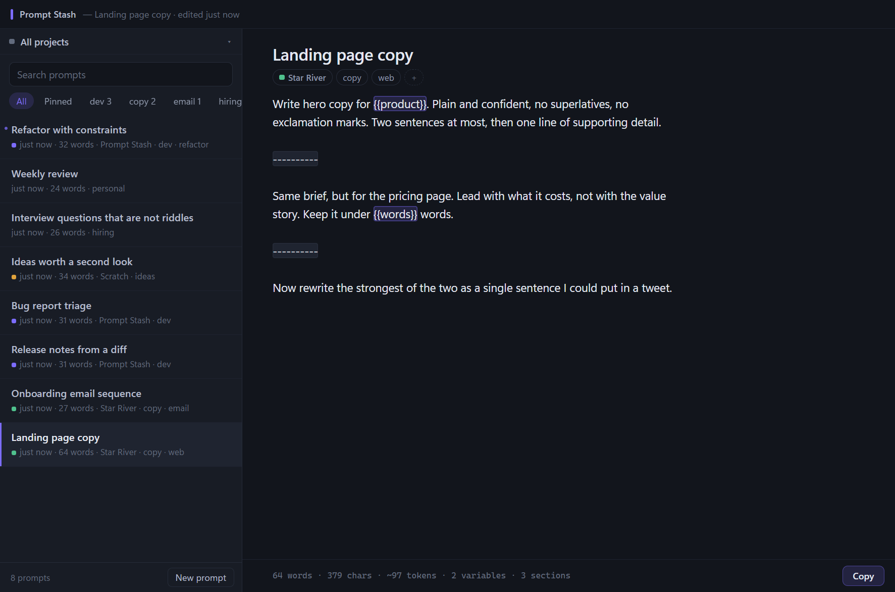
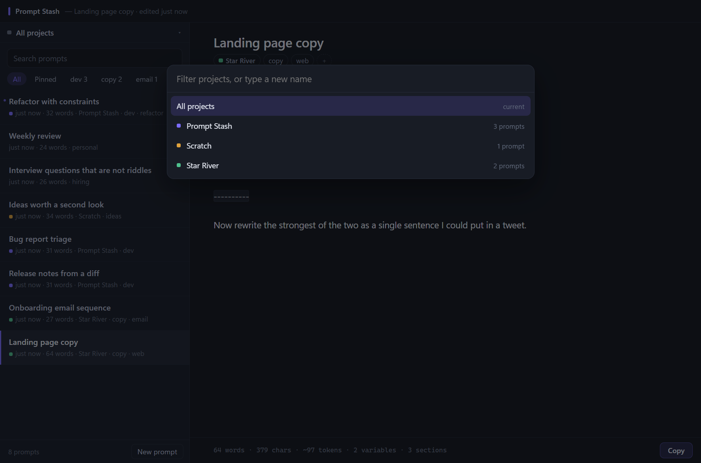
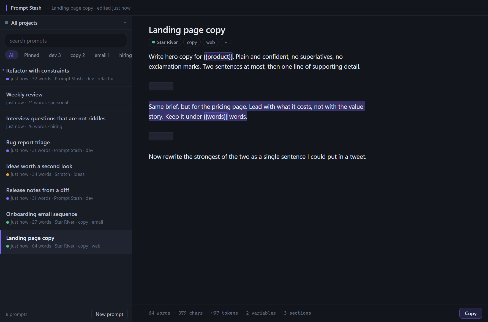

# Prompt Stash

A local place to draft and keep the prompts you write for building apps and thinking
through ideas. Everything saves itself. Nothing leaves your machine.



## Install

Download from [the latest release](https://github.com/Michaelihc/prompt-stash/releases/latest):

| Your machine | File |
| --- | --- |
| Windows on Intel or AMD — almost everyone | `PromptStash-Setup-<version>-x64.exe` |
| Windows on ARM — Surface Pro X / 11, Snapdragon X | `PromptStash-Setup-<version>-arm64.exe` |
| Not sure | `PromptStash-Setup-<version>.exe` — contains both, picks for you |

It installs for your user only, so Windows will not ask for administrator rights. The
installer is not code-signed, so SmartScreen shows a "Windows protected your PC" notice
the first time — **More info → Run anyway**. Every release ships `SHA256SUMS.txt` if you
would rather check the file first:

```powershell
Get-FileHash .\PromptStash-Setup-1.0.0-x64.exe -Algorithm SHA256
```

Your prompts live in `%APPDATA%\Prompt Stash\stash.db`. Uninstalling leaves that folder
alone; removing the app never removes your writing.

Building it yourself: `npm install && npm run dist` produces both installers in
`release/`, and `npm run check-arch` reads their PE headers back to confirm each one is
the architecture it claims to be.

## What it does

- **Autosaves.** No save button. In-progress text reaches the disk within 120ms; the
  full save lands 300ms after you stop typing, and always before the window closes.
- **Projects.** Every prompt can be filed under one project. The scope control at the top
  of the list narrows everything below it — search, pinned, tags, and new prompts all act
  inside the project you are in.
- **Sections.** `Ctrl+Enter` drops a divider into a prompt, so one entry can hold several
  variants. `Ctrl+A` then selects only the section you are in, not the whole prompt.
- **Finds anything.** Type in the search box and the list filters in the same frame;
  a full-text search of every prompt body joins a few milliseconds later.
- **Fills in placeholders.** Write `{{file}}` anywhere in a prompt. Copying asks for the
  values first and remembers what you last used.
- **Keeps history.** Substantial edits snapshot the previous text. `Ctrl+H` browses it.
- **Keeps your data yours.** SQLite on your disk, exportable to JSON or to one Markdown
  file per prompt, with rotating automatic backups.

## Projects



The button above the search box is the current scope. Click it (or `Ctrl+Shift+O`) to
switch projects; type a name that does not exist yet and the first row offers to create
it. The same picker, reached from the chip beside a prompt's title or with
`Ctrl+Shift+P`, files the open prompt.

A project is a scope, not a folder: deleting one never deletes prompts, it just leaves
them unfiled. Each project gets a colour on creation, which is what the dot in each list
row is showing you.

Tags are the other axis and stay free-form — a prompt has one project and any number of
tags.

## Sections inside one prompt



Press `Ctrl+Enter` and Prompt Stash writes a line of hyphens across the prompt, ending
the current section and starting a new one. It is a plain `----------`, so the text stays
useful anywhere you paste it and reads as a rule in Markdown.

`Ctrl+A` selects only the section the caret is in — the screenshot above shows the middle
of three selected, with the dividers untouched either side. That makes it quick to keep
several drafts of the same prompt in one entry and grab exactly one. Press `Ctrl+A` again
and it widens to the whole prompt, so nothing is out of reach.

The footer counts sections once you have more than one.

## Keys

| | |
| --- | --- |
| `Ctrl` `N` | New prompt (lands in the current project) |
| `Ctrl` `K` | Command palette, and jump to any prompt by name |
| `Ctrl` `F` | Search |
| `Ctrl` `Enter` | Start a new section |
| `Ctrl` `A` | Select this section, then the whole prompt |
| `Ctrl` `Shift` `C` | Copy, filling in placeholders first |
| `Ctrl` `Shift` `P` | File this prompt under a project |
| `Ctrl` `Shift` `O` | Switch which project the list is showing |
| `Ctrl` `D` | Duplicate |
| `Ctrl` `P` | Pin or unpin |
| `Ctrl` `H` | Earlier versions |
| `Ctrl` `Shift` `Delete` | Move to trash (`Undo` in the toast, or 30 days in the trash) |
| `Ctrl` `Shift` `T` | Show trash |
| `Ctrl` `,` | Settings and data |
| `Alt` `↑` `↓` | Previous / next prompt without leaving the editor |
| `F2` | Rename |
| `Ctrl` `S` | Save now (it was already saving) |

Nothing here overrides a normal text-editing key. `Ctrl+Delete` and `Ctrl+Backspace` stay
as delete-word, which is why trash is on `Ctrl+Shift+Delete`.

## How your prompts are kept safe

The store is SQLite through Node's built-in `node:sqlite` — no native modules, nothing
to rebuild, nothing that can fail to compile on a future machine.

- `journal_mode = WAL`, `synchronous = FULL`: every save is a committed transaction that
  is fsynced before it returns. A crash or power loss cannot leave a half-written prompt.
- The text you are typing is mirrored to a `drafts` table every 120ms — a single row with
  no triggers, so it costs a fraction of a millisecond and does not wait for the full
  autosave. If the app dies mid-sentence, the next launch carries that text back in,
  routed through the normal save path so whatever it replaces goes into history first.
  A draft older than the prompt it belongs to is discarded rather than applied, so a
  leftover can never revert a good save.
- Startup runs `quick_check`. If the file will not open, the app **quarantines it rather
  than deleting it** and restores the newest backup, telling you it did so.
- Backups rotate daily, ten deep, taken with `node:sqlite`'s streaming `backup()` so they
  are consistent even while you are typing and never block the window.
- Deleting a project unfiles its prompts. Emptying the trash is the only action in the app
  that destroys text, and it asks first.
- Imports never overwrite newer local text, and anything they do replace is snapshotted
  into history first.
- A `U+0000` in pasted text is stripped, because SQLite would otherwise silently truncate
  the prompt at that byte.

## Performance notes

Measured on a 20,000-prompt database (`npm test` prints these):

| | |
| --- | --- |
| Load every prompt summary | ~60-90ms |
| Search, median / worst | ~9ms / ~21ms |
| One durable save | ~0.3ms |

The list is virtualised with recycled rows, so scrolling 50,000 prompts costs what
scrolling twenty costs. The renderer is 38kb of plain TypeScript — no framework — and
holds summaries only, never the full text of every prompt.

Two things worth recording, because neither was obvious.

**localStorage is not a durability mechanism.** The draft mirror was written against
localStorage first. Chromium buffers it in memory and flushes on a clean shutdown, so it
survived exactly the crashes that did not need it — after a hard kill the data was still
not on disk six seconds later. `tools/test-durability.mjs` caught this by killing the
real app and reading the files back. The mirror now goes to SQLite, and the same test
proves the in-progress text is readable from a second process while you are still typing.

**A search query can be mis-planned into a 30-second stall.** Written as a flat
`JOIN` between the FTS index and the prompts table, search took **15–30 seconds** per
keystroke on a 20k database. SQLite was driving the join from `idx_prompts_trashed` and
probing the full-text index once per row. Materialising the FTS top-N in a subquery first
pins the join order and brings it back to milliseconds. `ANALYZE` also fixes the plan, but
the subquery is immune whether or not statistics exist. See `search()` in
`src/main/store.ts`.

One known limit: a search whose terms appear in almost every prompt has to rank every
match, which is tens of milliseconds at 20k and would grow past a frame at 50k. The list
still paints instantly from its own index — only the deeper body matches arrive late.

## Development

```
npm install
npm run dev         # watch + relaunch
npm start           # build and run once
npm test            # store + section logic: durability, corruption, migrations, scale
npm run test:ui     # drives the real renderer and asserts what you would see
npm run test:crash  # kills the running app and checks what survived
npm run test:all    # everything
npm run typecheck
npm run shots       # seeds a demo profile and captures the screenshots above
npm run dist        # build both installers into release/
npm run check-arch  # verify each built exe is really x64 / ARM64
```

The app icon is generated, not drawn: `npm run icon` rasterises it from signed-distance
fields and writes a seven-size `.ico` with no image libraries involved.

## Shape of the code

```
src/shared/types.ts     the contract between processes, and every tuning constant
src/main/store.ts       SQLite: schema, migrations, projects, search, backups, import/export
src/main/main.ts        window, IPC handlers, quit-flush, security posture
src/preload/preload.ts  the entire privileged surface — a fixed channel allowlist
src/renderer/           state, virtual list, editor, overlays; no framework
```

The renderer runs sandboxed with `contextIsolation`, no Node integration, a strict CSP,
and navigation and window-opening both blocked. It talks to the main process only through
the names listed in `preload.ts`.

The database is at schema version 4; `migrate()` in `src/main/store.ts` walks a stash
forward from any earlier version, and `npm test` exercises that path on a hand-built
older database rather than assuming it works.
